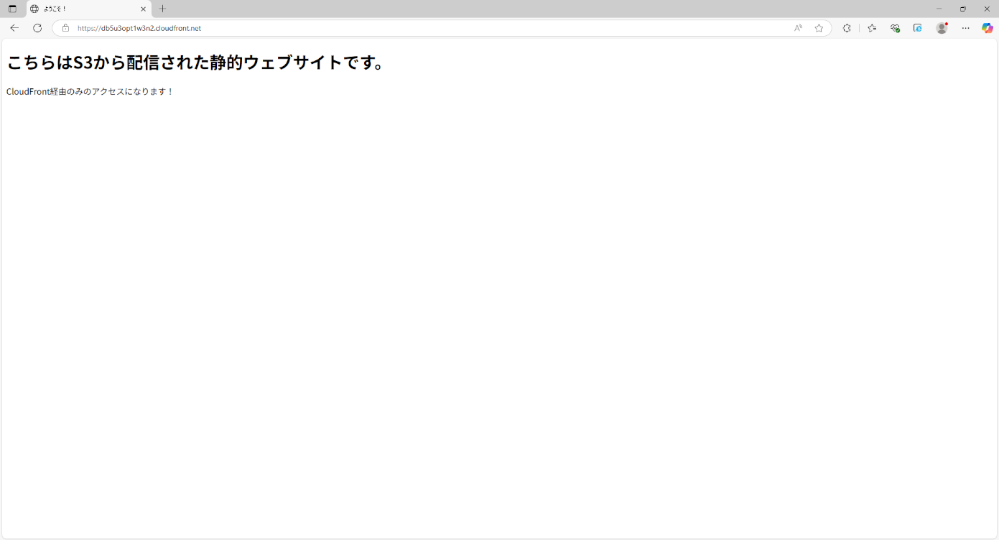
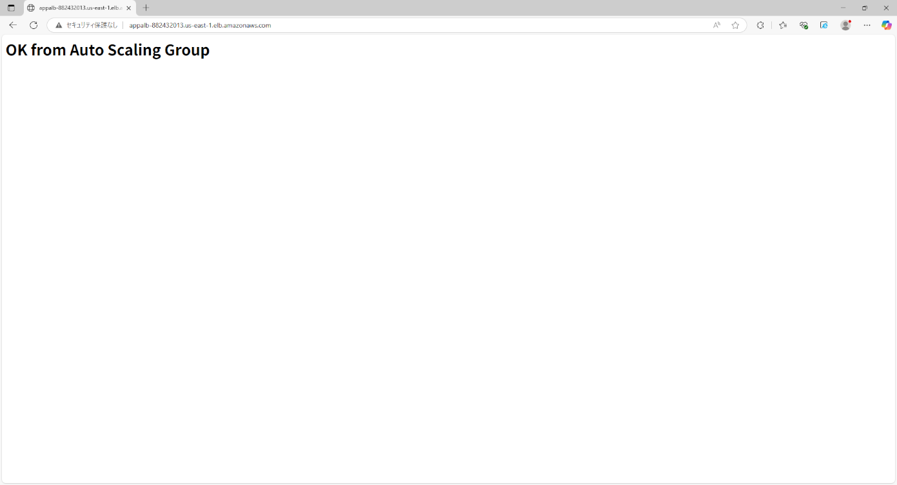

# AWS Infrastructure Portfolio (CDK × Python)
**AWS CDK（Python）を使って構築したインフラ構成のポートフォリオです。**  
**静的コンテンツは S3 と CloudFront を使ってホスティングし、**  
**動的コンテンツは EC2 上でアプリケーションを稼働させる構成を想定しています。**  
**VPC / EC2 / RDS / ALB / S3 / CloudFront などをIaCとして管理しています。**  

##  使用技術・サービス一覧

- **AWS CDK (Python)**
- **VPC**（Public / PrivateSubnet, 2AZ）
- **EC2（Auto Scaling Group + Apache）**
- **ALB（Application Load Balancer）**
- **RDS（PostgreSQL）**
- **S3 + CloudFront（静的コンテンツ配信）**
- **SSM + VPCエンドポイント**
- **セキュリティグループの適切な制御**

##  インフラ構成図

## デプロイ手順

PowerShell上で以下を順に実行します：

-- 仮想環境作成・起動  
※ Windows の場合  
python -m venv .venv  
.venv\Scripts\Activate.ps1  
※ macOS / Linux の場合  
python3 -m venv .venv  
source .venv/bin/activate

-- 依存ライブラリインストール  
pip install -r requirements.txt

-- CDK初期化（初回のみ)  
cdk bootstrap

-- CDKデプロイ（全スタック)  
cdk deploy --all

##  意識した点
UserData を用いて EC2起動時に Apache を自動インストール

CloudFront + S3 を使った静的ファイル高速配信

EC2 → RDS、ALB → EC2、SSM → EC2 など最小限の通信のみ許可(セキュリティグループ)

RDS は RemovalPolicy.RETAIN を指定して、誤削除を防止

スケーリングポリシー実装：CPU 70% でスケールアウト、30% でスケールイン。

静的コンテンツ自動デプロイ：staticディレクトリの中身をCloudFront経由で即時配信。

パブリックアクセス制御：S3バケットは完全非公開 + OAI経由でのみアクセス許可。

##  動作確認
以下のとおり、各構成要素が正常に動作することを確認済みです。

-  CloudFront経由で静的サイトにアクセス可能  
  

-  EC2 インスタンスに Session Manager 経由でアクセス成功  
  

-  ALB 経由で EC2 上の Web アプリにアクセス成功（200 OK）  
  
